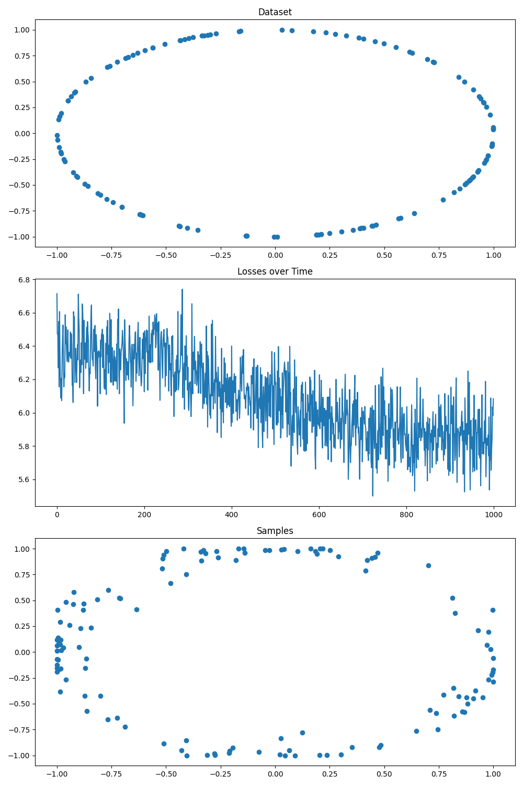

## Bayesian Flow - Pytorch

A standalone library for adding <a href="https://arxiv.org/abs/2308.07037">Bayesian Flow</a> in Pytorch.

## Install

```bash
$ pip install -e .
```

## Features

- [ ] Continuous Data Discrete Time Loss Implementation
- [x] Continuous Data Continuous Time Loss Implementation
- [x] Continuous Data Sampler Implementation
- [x] Continuous Data Example


- [ ] Discretised Data Discrete Time Loss Implementation
- [ ] Discretised Data Continuous Time Loss Implementation
- [ ] Discretised Data Sampler Implementation
- [ ] Discretised Data Example


- [ ] Discrete Data Discrete Time Loss Implementation
- [x] Discrete Data Continuous Time Loss Implementation
- [x] Discrete Data Sampler Implementation
- [x] Discrete Data Example

## Usage

```python
import torch
from bayesian_flow_torch import BayesianFlow

# Instantiate your torch model
model = ...

# Instantiate Bayesian Flow for continuous data
# Sigma must be set
bayesian_flow = BayesianFlow(model=model, sigma=0.001)

# Compute the continuous data continuous time loss
loss = bayesian_flow.continuous_data_continuous_loss(x=..., model_kwargs=...)

# Generate samples from the model 
samples = bayesian_flow.continuous_data_sample(size=..., num_steps=..., device=..., model_kwargs=...)
```

```python
import torch
from bayesian_flow_torch import BayesianFlow

# Instantiate your torch model
model = ...

# Instantiate Bayesian Flow for discrete data
# Number of classes and Beta must be set
bayesian_flow = BayesianFlow(model=model, num_classes=..., beta=...)

# Compute the discrete data continuous time loss for the batch
loss = bayesian_flow.discrete_data_continuous_loss(ids=..., model_kwargs=...)

# Generate samples from the model 
# Size should not include the number of classes
samples = bayesian_flow.discrete_data_sample(size=..., num_steps=..., device=..., model_kwargs=...)
```

## Examples

In the examples directory are simple toy examples.

<p align="center">
  
  <br>
  <b>Figure 1. Continuous Data: Predict Circle Coordinates</b>
</p>


<p align="center">
  
  <br>
  <b>Figure 2. Discrete Data: Predict XOR Logic</b>
</p>

## Citations

```bibtex
@misc{graves2023bayesian,
      title={Bayesian Flow Networks}, 
      author={Alex Graves and Rupesh Kumar Srivastava and Timothy Atkinson and Faustino Gomez},
      year={2023},
      eprint={2308.07037},
      archivePrefix={arXiv},
      primaryClass={cs.LG}
}
```