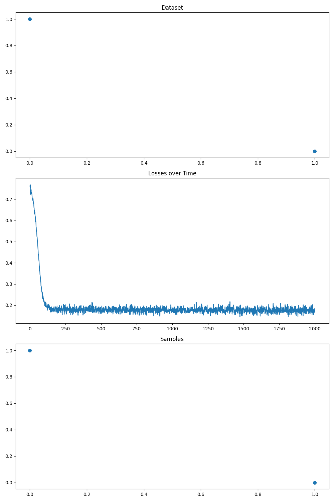

## Bayesian Flow - Pytorch

A standalone library for adding <a href="https://arxiv.org/abs/2308.07037">Bayesian Flow</a> in Pytorch.

## Install

```bash
$ pip install -e .
```

## Features

#### Continuous Data
- [ ] Discrete Time Loss
- [x] Continuous Time Loss
- [x] Sampler
- [x] Example
- [ ] Self-Conditioning

#### Discretised Data
- [ ] Discrete Time Loss
- [ ] Continuous Time Loss
- [ ] Sampler
- [ ] Example
- [ ] Self-Conditioning

#### Discrete Data
- [ ] Discrete Time Loss
- [x] Continuous Time Loss
- [x] Sampler
- [x] Example
- [ ] Self-Conditioning

## Utilised By

[bayesian-flow-mnist](https://github.com/thorinf/bayesian-flow-mnist): 
A simple Bayesian Flow model for MNIST in Pytorch. 
Replicated the binarised MNIST generation, and can also generate MNIST as continuous data.


## Usage

```python
import torch
from bayesian_flow_torch import BayesianFlow

# Instantiate your torch model
model = ...

# Instantiate Bayesian Flow for continuous data
# Sigma must be set
bayesian_flow = BayesianFlow(sigma=0.001)

# Compute the continuous data continuous time loss
loss = bayesian_flow.continuous_data_continuous_loss(model=..., target=..., model_kwargs=...)

# Generate samples from the model 
samples = bayesian_flow.continuous_data_sample(model=..., size=..., num_steps=..., device=..., model_kwargs=...)
```

```python
import torch
from bayesian_flow_torch import BayesianFlow

# Instantiate your torch model
model = ...

# Instantiate Bayesian Flow for discrete data
# Number of classes and Beta must be set
# For binary data, i.e. `num_classes=2`, you may also set `reduced_features_binary=True` to reduce the features to 1
bayesian_flow = BayesianFlow(num_classes=..., beta=..., reduced_features_binary=...)

# Compute the discrete data continuous time loss for the batch
# Target may contain class indices, or class probabilities [0, 1]. 
# Target probalities final dimension must match number of classes, unless `reduced_features_binary=True` where it's 1.
loss = bayesian_flow.discrete_data_continuous_loss(model=..., target=..., model_kwargs=...)

# Generate samples from the model 
# Size should not include the number of classes
samples = bayesian_flow.discrete_data_sample(model=..., size=..., num_steps=..., device=..., model_kwargs=...)
```


## Examples

In the examples directory are simple toy examples.

<p align="center">
  
  <br>
  <b>Figure 1. Continuous Data: 'Two Moons' Coordinates</b>
</p>


<p align="center">
  
  <br>
  <b>Figure 2. Discrete Data: Predict XOR Logic</b>
</p>

## Citations

```bibtex
@misc{graves2023bayesian,
      title={Bayesian Flow Networks}, 
      author={Alex Graves and Rupesh Kumar Srivastava and Timothy Atkinson and Faustino Gomez},
      year={2023},
      eprint={2308.07037},
      archivePrefix={arXiv},
      primaryClass={cs.LG}
}
```